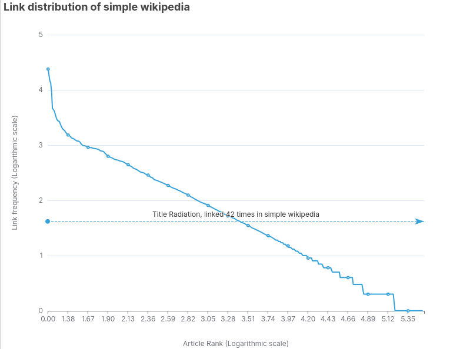

Here is the corrected version of your documentation, with grammar mistakes fixed and minor sentence structure changes for better readability.

# Link Suggestion System

This document outlines the architecture of the link suggestion system.

## Introduction

Given a Wikipedia article, we want to find possible text segments in the article that can be converted to a link to existing articles in the same wiki. Links help people learn and discover more content.

- The system should work with all languages where Wikipedia exists.
- The system should respect the linking conventions of the community. For example, stop words, numbers, months, and continents should not be linked.
- Since this is a recommendation system, it is acceptable if we do not suggest every possible candidate. However, when we do suggest something, it is very important that the suggestion is valid.

**Constraints:**

- If a text segment has never been linked in a wiki, do not suggest it as a candidate. In other words, a human must link the text segment first.
- If a text segment is already linked in an article, do not suggest it again.
- Learn from the statistical distribution of links in the wiki. This will avoid the need for hard-coded no-link rules for each wiki.
- The system should be highly performant. Links should be suggested for any language and article in under a second.
- Should not require pre-calculating (offline calculation) of suggestions.
- The data preparation pipelines should be performant and simple.
- Should not depend on the freshness of offline data.

## Existing System

See <https://meta.wikimedia.org/wiki/Research:Link_recommendation_model_for_add-a-link_structured_task>

The existing system for link suggestions is a machine learning-based approach, developed by the Wikimedia Foundation's research team and operated by the Machine Learning team. It is an XGBoost-based classifier system. There are ongoing efforts to make it work for more languages and avoid having individual models per language.

Semantic similarity of Wikipedia articles is a hard problem. Vector embeddings of the content need to be created first, and then the similarity needs to be calculated using techniques like cosine similarity. To calculate vector embeddings, we need embedding models, and their availability and performance are also a concern.

### Machine Learning Approach

I approached the problem by reading the research about link suggestions and trying to understand the problem modeling. A question I had was why this problem is considered probabilistic and where the need for machine learning arises.

The following are the features for the classifier model in the existing machine learning-based approach.

- **ngram**: The number of words in the anchor (based on simple tokenization).
- **frequency**: The count of the anchor-link pair in the anchor-dictionary.
- **ambiguity**: How many different candidate links exist for an anchor in the anchor-dictionary.
- **kurtosis**: The kurtosis of the shape of the distribution of candidate links for a given anchor in the anchor-dictionary.
- **Levenshtein-distance**: The Levenshtein distance between the anchor and the link. This measures how similar the two strings are. Roughly speaking, it corresponds to the number of single-character edits one has to make to transform one string into another (e.g., the Levenshtein distance between “kitten” and “sitting” is 3).
- **w2v-distance**: The similarity between the source page and the target page, based on the content of the pages. This is obtained from wikipedia2vec.

Among these, `w2v-distance` requires an embedding model to prepare vector embeddings for the article. Embedding computation is also needed at the inference stage.

The reason for including that feature is this assumption: "The rationale is that a link might be more likely if the corresponding article is more similar to the source article."

I find this characterization of links in a Wikipedia article difficult to accept. The outward links from a politician's article could lead to articles of any category. It could be places, events, geographies, philosophies, or anything else. The famous Wikipedia "rabbit hole" concept relies on the fact that from a single wiki article, a casual reader can reach completely unrelated articles, and that path takes the reader through a "rabbit hole" experience. Confining outward links to topics closely related to the source article is not in alignment with this "rabbit hole" idea.

To objectively look into this case, let us consider the [Rickshaw](https://simple.wikipedia.org/wiki/Rickshaw) article from simple.wikipedia.org. A rickshaw is a type of two-wheeled vehicle, usually pulled by a human. The outward links in that article are as follows:

1. Wheel
2. Vehicle
3. Bicycle
4. Motor
5. Human
6. Japan
7. Bangladesh

As we can easily observe, the articles represented by the target links are not all related to 'Rickshaw'. The relation I am referring to is based on vector embeddings of article content, Wikipedia article categories, or the topic classification for these articles by the [Wikipedia article topic model](https://meta.wikimedia.org/wiki/Machine_learning_models/Production/Language_agnostic_link-based_article_topic).

We can calculate the topics from the article topic model as follows:

```bash
curl https://api.wikimedia.org/service/lw/inference/v1/models/outlink-topic-model:predict -X POST -d '{"page_title": "Rickshaw", "lang": "simple"}' -H "Content-type: application/json"
```

```json
{
  "prediction": {
    "article": "https://simple.wikipedia.org/wiki/Rickshaw",
    "results": [
      { "topic": "Geography.Regions.Asia.Asia*", "score": 0.9724247455596924 },
      { "topic": "Culture.Sports", "score": 0.6513648629188538 },
      {
        "topic": "History_and_Society.Transportation",
        "score": 0.546748161315918
      },
      { "topic": "STEM.STEM*", "score": 0.546748161315918 }
    ]
  }
}
```

I would expect the most preferred classification to be `Transportation`. The presence of `Culture.Sports` as the second possible topic for 'Rickshaw' is interesting, as rickshaws are not related to any sports, to my knowledge.

What we are observing here are the consequences of the assumption that outward links in an article are related to the source article. This assumption is the basis for incorporating `w2v-distance` in the feature set for link recommendation. This is also the basis for the topic classification model. In the topic classification model, the topics of outward links are used as features for the classification of the source article. That explains why 'Rickshaw' is associated with `Asia` and `Sports`. The STEM topic is present because `Human` is classified as a STEM topic by the model.

```bash
 curl https://api.wikimedia.org/service/lw/inference/v1/models/outlink-topic-model:predict -X POST -d '{"page_title": "Human", "lang": "simple"}' -H "Content-type: application/json"
```

```json
{
  "prediction": {
    "article": "https://simple.wikipedia.org/wiki/Human",
    "results": [
      { "topic": "STEM.STEM*", "score": 0.9553291201591492 },
      { "topic": "STEM.Biology", "score": 0.59267657995224 }
    ]
  }
}
```

However, it is possible that the largest cluster of topics of outward links relates to the source article in many cases. For example, in the case of 'Rickshaw', the first four links—Wheel, Vehicle, Bicycle, and Motor—are related to the rickshaw and fall under Transportation. I would expect this pattern to exist for many articles. Because of this, topic classification based on the topics of outward links will work in most cases. However, it is very important to note that the reverse is not true—that an outward link is probable if its topic is related to the source article.

For example, if a source article has 20 outward links and 5 of them are of topic T1, predicting T1 as the most probable topic for the source article may be acceptable. But the other 15 links have other topics, say, T2, T3, T4, T5, and T6. This implies that links in the source article could be to any topic from T1 to T6, and we cannot give a higher preference to links with topic T1.

Let's take another look at the link suggestions API by getting link suggestions for 'Mount Everest' in Simple Wikipedia.

```bash
curl 'https://api.wikimedia.org/service/linkrecommendation/v1/linkrecommendations/wikipedia/simple/Mount%20Everest'
```

It gives three suggestions:

1. New Zealand
2. North pole
3. South pole

All these suggestions are correct. However, this article can be linked to many other articles while following the conventions of simple.wikipedia.org. For example, there is a mention of 'British people,' which is linked 113 times in other simple.wikipedia.org articles. There is also a mention of 'human,' which has been linked 282 times by editors. These suggestions are missing because the algorithm prefers links with similar topics. All three suggestions match the `Geography.Geographical` topic of 'Mount Everest'.

All this is to say that the similarity between source and target articles is not a feature that should be considered for this problem. If we remove that from the feature set, all other factors contributing to the prediction are deterministic features that can be computed relatively easily. However, the statistical distribution of links in a wiki is definitely a contributing factor. For example, simple.wikipedia.org has a practice of linking to words like 'year', 'human', 'heat', 'food', 'water', etc. But this may not be the pattern in, say, English Wikipedia. Identifying these patterns across all languages will require a statistical model of links.

This realization prompted me to attempt a non-machine-learning-based approach. I also wanted it to be very simple and performant.

## Algorithm

### Data Preparation

To check whether an arbitrary text segment can be linked to an article, we need to know if that text segment corresponds to an article title. This can be done in many ways:

1. Use a web API like the search API to find if a text can match a title.
2. Directly query the MediaWiki database table.

The first approach, if applied to all possible text segments in an article, would require several API calls and be very slow. The second approach would also be slow. Additionally, it requires the ability to connect to a MediaWiki database or replica at runtime, which may not always be possible.

Instead, our system builds a bloom filter of all titles in a wiki. This is prepared as a one-time data preparation task. We query a production database to get all titles and prepare a bloom filter from them.

[Bloom filters](https://en.wikipedia.org/wiki/Bloom_filter) are compact and extremely fast for checking if a given text segment is present. If an item is not present, the result is 100% accurate. If it is present, there is a controllable error margin, known as the false positive rate. On a standard machine, preparing the bloom filter for 342 wikis takes less than a minute when the `make -j bloom` command is executed, as it parallelizes the jobs.

```bash
$ time make  bloom/simplewiki.bloom
echo "select page_title from page where page_namespace=0 and page_is_redirect = 0" | analytics-mysql simplewiki > titles/simplewiki.titles.list
./target/release/bloom-builder build -i titles/simplewiki.titles.list -o bloom/simplewiki.bloom
Building Bloom filter with calculated capacity 271333 and false positive probability 0.001
Added 271333 unique lines to the Bloom filter.
Bloom filter built and saved to "bloom/simplewiki.bloom"

real    0m1.302s
user    0m0.289s
sys     0m0.135s
```

Checking if a title exists or not:

```bash
cargo run --bin bloom-builder -- check  -f bloom/simplewiki.bloom -w Starch
Checking for word: "Starch"
The word "Starch" is PROBABLY in the filter (due to false positives, this is not 100% certain).
```

```bash
cargo run --bin bloom-builder -- check  -f bloom/simplewiki.bloom -w SomeThingThatDoesNotExist
Checking for word: "SomeThingThatDoesNotExist"
The word "SomeThingThatDoesNotExist" is NOT in the filter.
```

You may also notice that these checks are extremely fast. With the false positive rate set to 0.001, the bloom filter for all titles in Simple Wikipedia is 487 kilobytes. Note that this wiki has 271K articles.

With this bloom filter, we can check thousands of text segments in a fraction of a second. There is a 0.001% false positive rate, but we will eliminate any false positives when we shortlist the candidates at a later stage.

How often should we update this filter? Suppose a new article is created in simple.wikipedia.org after this filter was created. The filter will indicate that the article is not present. Our suggestion system will then ignore text segments matching that new title. Not suggesting a brand-new article title is an acceptable limitation. Additionally, we set a constraint that all the suggestions we make are based on link frequency—how many times an article is linked. For new articles, it will take time for editors to start linking to them and for those links to meet our frequency thresholds. By that time, we will likely have updated our filters. Updating this filter once a month is sufficient.

We also need another bloom filter for link labels to handle cases where the link text differs from the article title. The link labels are collected by parsing the full wiki dump, as explained below.

### Text Segments

For a given text, each word can be a link candidate. Phrases consisting of two or more words can also be link candidates. For example, 'United States of America' is a four-word link candidate. We will extract all combinations of one, two, three, and four words.

However, how do we find the text runs in an article's wikitext content? An article's wikitext markup will have templates, links, references, and other elements. We should only suggest links for the plain text parts of the article. This requires parsing the article and identifying plain text ranges. We use the [tree-sitter-wikitext](https://github.com/santhoshtr/tree-sitter-wikitext/) parser for this purpose. This is a very fast, error-tolerant parser for wikitext and is available in C, Go, Rust, JS, Wasm, and Python environments. We use the Rust bindings of tree-sitter-wikitext.

Not all text segments are appropriate for linking. Some communities have their own linking conventions. For example, years, numbers, stop words, month names, continent names, etc., are not usually linked in English Wikipedia. Hard-coding such rules is one option, but it won't scale for all language communities. In our approach, we will not hard-code these rules; instead, we will learn these conventions from the frequency distribution of links.

### Frequency Distribution of Links

Some articles will be linked frequently in a wiki. Some will be linked very rarely. Knowing this pattern accurately will help us rank and prioritize suggestions.

To understand this pattern, let us look at simple.wikipedia.org. The most linked-to title in that wiki is [Departments_of_France](https://simple.wikipedia.org/wiki/Departments_of_France), with 23,789 links. `Communes_of_France`, `France`, `United_States` (13,192), `Regions_of_France`, `Cantons_of_Switzerland`, `Germany` (4,491), and `Italy` (4,194) follow. `Europe` is linked 900 times, `Finland` is linked 486 times, `Mathematician` is linked 100 times, and `Indo-Iranic_languages` is linked 3 times, and so on. The distribution is non-uniform. Our link suggestions should adhere to this distribution to match community linking conventions.

To learn this distribution, we need to collect all links and their frequency of occurrence. We also need to consider that the link label will often be different from the link title. We need to capture that information as well.

Preparing this data requires finding all links in all of a wiki's articles. Finding all links in an article is also required at inference time (runtime) to avoid suggesting links for already-linked text. Here, too, we will use tree-sitter-wikitext. Parsing a wiki's wikitext dump is not an easy task, but tree-sitter-wikitext can handle huge dumps without issues. Parsing the ~80 GB wikitext dump of English Wikipedia takes about 5 hours. However, other wikis can be parsed in minutes. A bottleneck here is the bzip2-compressed dumps, as they cannot be decompressed in a multi-threaded way. Therefore, we are confined to a single thread for decompression. However, our architecture allows for parallelizing the parsing of multiple wiki dumps. We won't decompress and then parse; instead, we will stream the bzip2 file directly to our link extractor.

The output of this parsing is one SQLite database per wiki. The distribution statistics I shared above are based on the simplewiki.sqlite file (~173MB). For English Wikipedia, this database is an approximately 3.8 GB SQLite file.

### Confidence Score

Once we get a list of possible candidates from the bloom filter step, we need to rank them. At this stage, we will calculate the candidate's position in the wiki's link distribution. If a candidate is not linked frequently, we will drop it. To place our candidate in the link distribution, we will use the following approach.

Since the linking frequency is not uniform, we will use the following formula to get the candidate's position as a value between 0 and 1. A score of 1 corresponds to the maximum link frequency for that wiki. In the case of simple.wikipedia.org, we found this to be 23,789. We call it $F_{max}$. We will use 1 as the minimum link frequency, denoted as $F_{min}$. The linking frequency for the candidate, denoted as $F_c$, is looked up in the SQLite database.

The candidate's position in this distribution, as a value between 0 and 1, is then:

$$
(log(F_{c}) - log(F_{min})) / (log(F_{max}) - log(F_{min}))
$$

We call this the `Confidence Score`.

The article 'Radiation' is linked 42 times in simple.wikipedia.org. What is the confidence score for suggesting that the text segment 'radiation' be linked to that title?

$$
log(42) - log(1)/ log(23789) - log(1)
$$

When $log_{10}$ is used, we get the result 0.37.

We can also visualize this title's position in the link distribution of the entire wiki. See the graph below. On the x-axis, we have the rank of articles—their index when sorted by frequency of occurrence in descending order. We plot this on a logarithmic scale since we have over 270k articles in Simple Wikipedia. On the y-axis, we plot the link frequency, also on a logarithmic scale.



The graph shows that a large number of links have a very low frequency, while a few have a very high frequency. The title 'Radiation', with a frequency of 42 ($log_{10}42 = 1.62$), is also marked on the graph. On the relative scale (0 to 1), we can see it appears above the 1/3 mark on the y-axis.

The higher an article is on this graph, the more confidence we have in suggesting it for linking.

## Prediction

We use the `Confidence Score` calculated above to rank the suggestions. For every suggestion, we can also provide the link label, the link title, and the position of the link label in the article's full wikitext.
